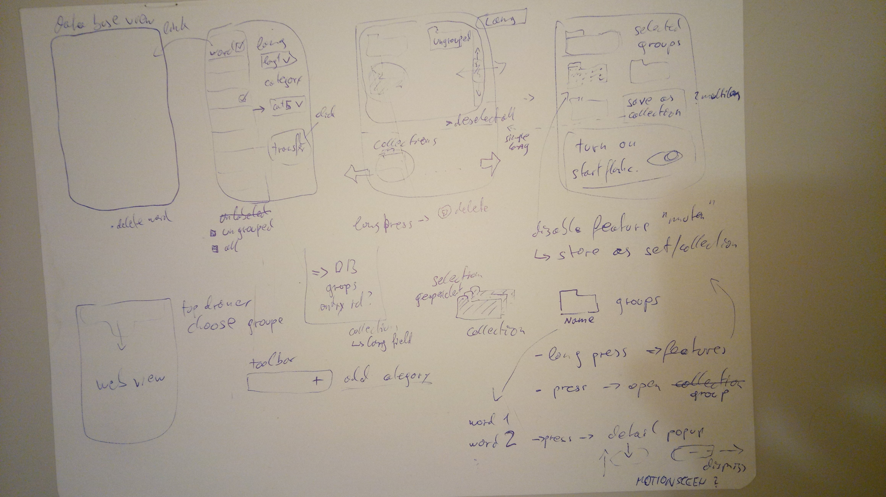

# KEEP IT

Android language learning app

The app assembles common website (online dictionaries, translators) at one place and makes it possible to utalize lookups for later learning sessions.
Vocabulary can be saved as it is looked up in the  browser webview. The data is being stored locally in a database (SQLite) and cann be managed in be managed inside the app.

### Webview
A Webview is used to display an array of websites. Through Javascript interfaces, it becomes possible to communicate with the running website from the app. In this way JS is executed on top of the websites (adding for example a star img that is used as a toggle button to save and delete words). Data from the website can be retrieved and stored in the database.

### Notifications

Prominent is the notification feature. Words from previously created collections will be displayed as notification. Similar to flashcards, it is possible to uncover the meaning of a word or move to the next word. This is even possible from the lockscreen.

**(for the moment notifications can be activated in SETTINGS)**

=> Media Notifiactions

### Broadcast Receiver

A Boradcast Receiver keeps the flashcard carousel running. It processes the notification actions and replaces notifications when the notification content is updated.

### Database

The Room framework is used to define the database that holds dictionary entries and collections.

### Point worth noticing:
- Allready stored words are marked when you revisit the website
- The CustomWebViewFragment serves as class for all the webviews. An attempt to reduce duplicated code.

### Remaining Problems:
This Project is still ongoing. Therefore, there are still many things open.

- **ONLY LANGENSCHEIDT FRAGMENT REALLY WORKING.** There where complications when trying to inject the other fragments in the first drawer section.
- automatic grouping in a selected collection when storing on website not yet functional
- replace runBlocking blocks so it does not block the main thread
- Settings: switching languages still buggy
- ui translation
- collection management fragments not yet completed 
- and of course: refactoring
